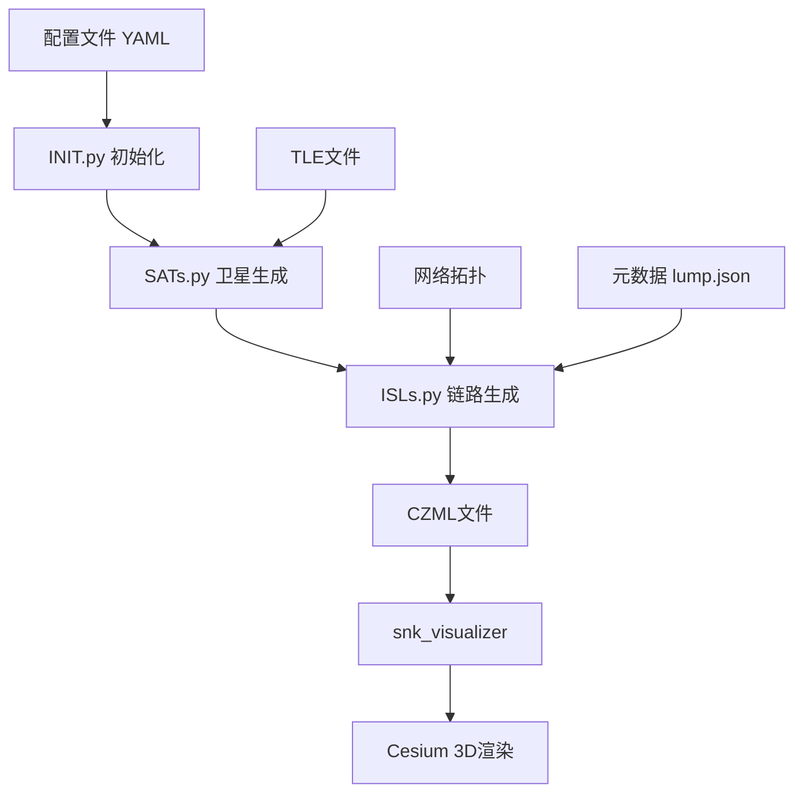

# SNK项目详细分析报告

## 1. 项目概述

**Space Networking Kit (SNK)** 是一个用于LEO（低地球轨道）巨型星座网络性能评估的仿真/仿真平台。该项目发表于IEEE ICC 2024会议，为卫星星座网络研究提供了完整的可视化仿真解决方案。

### 1.1 核心功能
- 卫星星座网络仿真与可视化
- 星间链路（ISL）拓扑生成与管理
- 路由与网络性能评估（延迟、拉伸度、网络容量、吞吐量）
- 实时通信可视化
- 支持固定和移动边缘站点的路由仿真

### 1.2 技术特点
- 基于SGP4轨道模型的精确轨道计算
- 使用CZML格式的时空数据可视化
- 支持多层星座和动态拓扑管理
- 模块化架构设计，易于扩展

---

## 2. 架构设计

### 2.1 整体架构

项目采用**模块化架构**，分为4个主要模块：

```
SNK
├── snk_scenario（场景生成器）
├── snk_visualizer（3D可视化）
├── snk_server（服务端，待完善）
└── snk_analyzer（分析器，待完善）
```

### 2.2 工作流程

1. **场景生成阶段**：`snk_scenario`根据配置生成卫星TLE、ISL拓扑，输出CZML文件
2. **可视化阶段**：`snk_visualizer`加载CZML文件，使用Cesium进行3D渲染
3. **分析阶段**：`snk_analyzer`对网络性能进行评估（规划中）

### 2.3 数据流图



---

## 3. 核心模块详解

### 3.1 snk_scenario（场景生成模块）

#### 3.1.1 目录结构

```
snk_scenario/
├── configs/config.yaml          # 配置文件
├── run.sh                       # 运行脚本
├── scripts_space/               # 核心脚本
│   ├── INIT.py                 # 初始化
│   ├── SATs.py                 # 卫星生成
│   └── ISLs.py                 # 星间链路生成
├── satgen/                      # TLE生成
│   └── tles/
│       ├── generate_tles_from_scratch.py
│       ├── generate_tles_from_tle.py
│       └── read_tles.py
├── satellite_czml/              # CZML格式转换
│   ├── czml.py
│   └── satellite_czml.py
├── structures/                  # 数据结构
│   ├── entity.py               # 实体类（卫星、ISL）
│   ├── snet.py                 # 网络拓扑管理
│   └── scenario_templates.py   # CZML模板
└── utils.py                     # 工具函数
```

#### 3.1.2 核心流程

**步骤1：INIT.py - 初始化**
- 创建输出目录
- 复制配置文件
- 初始化`lump.json`元数据文件

**步骤2：SATs.py - 卫星生成**
- 根据配置生成TLE（Two-Line Element）轨道根数
- 支持3种生成方式：
  1. `seed_satellite`：手动指定轨道参数
  2. `sgp`：使用SGP4模型生成
  3. `seed_tle`：从现有TLE派生
- 使用SGP4模型计算卫星位置轨迹
- 生成CZML格式的卫星实体
- 输出：`<layer_name>_sats.czml`、`<layer_name>_tle.txt`

**步骤3：ISLs.py - 星间链路生成**
- 构建网络拓扑（使用`snet.py`）
- 生成两种ISL：
  - **iISL（轨道内链路）**：同轨道内相邻卫星间的链路
  - **sISL（轨道间链路）**：相邻轨道间卫星的链路
- 支持动态链路可靠性模拟（通过duty_ratio控制可用时间间隔）
- 生成CZML格式的链路实体
- 输出：`<layer_name>_isls.czml`

#### 3.1.3 关键技术点

**1. TLE生成（generate_tles_from_scratch.py）**
- 使用SGP4模型（WGS72重力模型）
- 关键参数：
  - `mean_motion_rev_per_day`：平均运动速度（每天绕地圈数）
  - `inclination_degree`：轨道倾角
  - `eccentricity`：离心率
  - `raan`：升交点赤经
  - `phase_factor`：相位因子（用于相邻轨道的卫星偏移）

**2. 卫星轨迹计算（satellite_czml.py）**
- 使用`sgp4.propagate()`根据TLE计算ECI（地心惯性）坐标
- 时间步长可配置（`time_step`）
- 使用LAGRANGE插值算法平滑轨迹
- 坐标系：INERTIAL（惯性坐标系）

**3. 网络拓扑构建（snet.py）**
- 使用NetworkX构建图结构
- 拓扑生成算法：
  - 通过`connectivity_features`定义连接模式
  - 支持循环拓扑（`circuit=true`）和非循环拓扑
  - 使用`phase_factor`处理首尾轨道的缝合
- 关键方法：
  - `__build_adjacent_sats__`：计算每颗卫星的邻接卫星
  - `get_adj_mat`：生成邻接矩阵

**4. 链路可靠性模拟（ISLs.py）**
- 生成方波信号模拟链路间歇性可用
- 参数：
  - `duty_ratio`：占空比（链路可用时间比例）
  - `num_periods`：周期数
- 使用`intervals`机制在CZML中定义时间段

### 3.2 snk_visualizer（可视化模块）

#### 3.2.1 目录结构

```
snk_visualizer/
├── Apps/
│   ├── index.html              # 主页面
│   ├── main.js                 # 主逻辑
│   ├── response.js             # 交互响应
│   ├── common.js               # 全局变量
│   ├── utils.js                # 工具函数
│   └── CesiumSensors.js        # 传感器可视化
├── configs/config.yaml          # 可视化配置
└── Libs/                        # 第三方库
    ├── js-yaml.js
    └── 3d_models/
```

#### 3.2.2 技术栈
- **CesiumJS**：3D地球可视化引擎
- **CZML（Cesium Markup Language）**：时空数据描述语言
- **WebSocket**：与后端通信（预留接口）
- **JavaScript ES6模块**

#### 3.2.3 核心功能

**1. 数据加载（main.js - dataLoad）**
- 加载配置文件（YAML格式）
- 异步加载CZML数据源
- 初始化实体集合：
  - `sat_collection`：所有卫星
  - `layer_sat_collections`：分层卫星集合
  - `layer_isl_entities`：分层ISL实体

**2. 实体渲染**
- **卫星**：
  - 使用3D模型（GLTF格式）或点标记
  - 显示轨道路径
  - 显示标签
- **ISL链路**：
  - 使用polyline渲染
  - 支持时间间隔控制显示/隐藏
  - 颜色区分iISL和sISL
- **传感器锥体**：
  - 使用CesiumSensors插件
  - 自定义锥形体积（`CustomSensorVolume`）
  - 实时跟随卫星姿态

**3. 交互控制（response.js）**
- 图层切换（多星座层）
- 显示/隐藏控制：
  - SAT、ISL、iISL、sISL开关
  - 标签、轨道、传感器开关
- 单个实体控制（选中后）

#### 3.2.4 技术难点

**引用属性绑定（utils.js - make_isl）**
```javascript
// 将ISL的端点动态绑定到卫星位置
var refprop0 = new Cesium.ReferenceProperty(
    sat_collection, 
    target_sat_id, 
    ['position']
);
```
这使得链路自动跟随卫星移动，无需手动更新。

**传感器姿态同步（utils.js - sensorInstall）**
```javascript
viewer.scene.preRender.addEventListener((scene, time) => {
    let modelMatrix = satellite.computeModelMatrix(time);
    // 旋转180度（朝向地球）
    Cesium.Matrix4.multiply(modelMatrix, rotationMatrix, modelMatrix);
    sensor.modelMatrix = modelMatrix;
});
```
使用preRender事件在每帧渲染前更新传感器姿态矩阵。

---

## 4. 核心技术与算法

### 4.1 轨道力学

**SGP4模型**
- 简化的摄动模型（Simplified General Perturbations）
- 考虑地球扁率（J2项）、大气阻力
- 输入：TLE格式的轨道根数
- 输出：任意时刻的ECI坐标

**轨道参数计算**
- 平均运动速度与高度关系：
  ```
  n = sqrt(μ / a³)
  其中 μ = 地球重力常数
      a = 半长轴（地球半径 + 高度）
  ```
- 配置注释中给出了常见高度的n值：
  - 550km → 15.065 rev/day
  - 1000km → 13.707 rev/day
  - 1550km → 12.247 rev/day

### 4.2 网络拓扑生成

**Walker星座模式**
- 经典配置：T/P/F
  - T：卫星总数
  - P：轨道数
  - F：相位因子
- 通过`phase_factor`实现轨道间的相对偏移

**链路拓扑算法**
```python
# 轨道内链路：连接同轨道内的卫星
conn_features = [1]  # 连接下一颗卫星
adj_sat_id = (this_sat_no + delta) % num_sat

# 轨道间链路：连接相邻轨道
next_orbit_no = (this_orbit_no + 1) % num_orbit
if next_orbit_no == 0:  # 首尾轨道缝合
    next_sat_no = (this_sat_no + phase_factor) % num_sat
```

### 4.3 时空数据可视化

**CZML格式**
- JSON扩展，专为时空数据设计
- 核心概念：
  - **Packet**：实体描述（卫星、链路）
  - **Property**：时变属性（位置、颜色、可见性）
  - **Interval**：时间区间

**位置插值**
```json
{
  "position": {
    "epoch": "2000-01-01T00:00:00Z",
    "interpolationAlgorithm": "LAGRANGE",
    "interpolationDegree": 2,
    "cartesian": [
      0, x0, y0, z0,
      100, x1, y1, z1,
      ...
    ]
  }
}
```

**时间间隔控制**
```json
{
  "polyline": {
    "show": [
      {"interval": "T1/T2", "boolean": false},
      {"interval": "T2/T3", "boolean": true}
    ]
  }
}
```

---

## 5. 技术难点与解决方案

### 5.1 大规模数据处理

**难点**：大型星座（如12000颗卫星的Starlink）生成的数据量巨大
- 每颗卫星轨迹点数 = (end_time - start_time) / time_step
- 24小时，100秒步长 = 864个点 × 12000卫星 = 1000万+数据点

**解决方案**：
- 使用CZML的插值机制减少存储点数
- 分层加载（layer机制）
- 支持选择性加载（`load_data`配置）

### 5.2 动态拓扑管理

**难点**：ISL的连接会随时间变化（由于卫星相对运动）

**解决方案**：
- 使用`intervals`定义链路可用时间段
- 通过`duty_ratio`模拟链路间歇性
- 使用波形函数生成时变模式

### 5.3 实时渲染性能

**难点**：实时计算大量实体的变换矩阵

**解决方案**：
- 利用Cesium的插值引擎自动计算中间帧
- 使用引用属性（ReferenceProperty）避免重复计算
- 传感器更新只在preRender阶段执行

### 5.4 多层星座管理

**难点**：支持不同高度、倾角的多层星座

**解决方案**：
- 配置文件支持多`layer`定义
- 每层独立生成CZML文件
- 前端使用分层集合管理（`layer_sat_collections`）

---

## 6. 代码组织与设计模式

### 6.1 模块化设计
- **关注点分离**：场景生成、可视化、分析相互独立
- **配置驱动**：通过YAML文件控制行为
- **数据中心**：使用`lump.json`作为元数据中心

### 6.2 关键类设计

**Entity体系（structures/entity.py）**
```python
BasicEntity
    ├── setTime()     # 设置时间范围
    ├── setLabel()    # 设置标签
    └── setParent()   # 设置父实体

xSL (BasicEntity)
    ├── setLineColor()
    ├── add_interval()
    └── intervals_load()  # 加载时间间隔

ISL (xSL)  # 具体的星间链路实现
```

**Network类（structures/snet.py）**
```python
sNet
    ├── add_layer()           # 添加星座层
    ├── build_graph()         # 构建NetworkX图
    ├── get_adj_mat()         # 获取邻接矩阵
    └── __build_adjacent_sats__()  # 计算邻接关系
```

---

## 7. 配置系统

### 7.1 场景配置（snk_scenario/configs/config.yaml）

```yaml
# 时间设置
start_time: "2000-01-01T00:00:00"
end_time: "2000-01-02T00:00:00"
time_step: 100  # 轨迹采样间隔（秒）

# 星座配置
constellations:
  LAYER0:
    enable: true
    shellNo: 0
    num_orbits: 10          # 轨道数
    num_sats_per_orbit: 10  # 每轨道卫星数
    phase_factor: 0         # 相位因子
    
    # 轨道参数（三选一）
    seed_satellite:
      mean_motion_rev_per_day: 15.065  # 对应550km高度
      inclination_degree: 53
      eccentricity: 0.0000001
    
    # ISL配置
    ISL:
      enable: true
      circuit: true  # 是否循环拓扑
      
      iISL:  # 轨道内链路
        full_conn_features: [1]      # 连接偏移量（+1即相邻）
        conn_features_periods: [[-1]]  # 周期模式
        rgba: [0,0,255,255]          # 颜色
        duty_ratio: 1                # 占空比
        
      sISL:  # 轨道间链路
        full_conn_features: [-2,-1,0]  # 多个偏移（支持多连接）
        rgba: [0,255,0,255]
```

### 7.2 可视化配置（snk_visualizer/configs/config.yaml）

```yaml
base: "../data/new/"  # CZML文件路径
ip: "127.0.0.1"
port: "5678"
load_data: ['sats','isls']  # 加载内容
```

---

## 8. 使用方法

### 8.1 场景生成

**步骤1：编辑配置文件**
```bash
vi snk_scenario/configs/config.yaml
```
配置星座参数、轨道参数、ISL设置

**步骤2：运行生成脚本**
```bash
cd snk_scenario
bash run.sh
```
这将依次执行：
1. `INIT.py` - 初始化
2. `SATs.py` - 生成卫星
3. `ISLs.py` - 生成链路

**输出文件**（在`dump_path`指定的目录）：
- `config.yaml` - 配置备份
- `lump.json` - 元数据
- `<layer>_tle.txt` - TLE文件
- `<layer>_sats.czml` - 卫星CZML
- `<layer>_isls.czml` - 链路CZML

### 8.2 可视化

**步骤1：准备环境**
1. 将生成的场景目录移动到`snk_visualizer/data/`
2. 下载CesiumJS库到`snk_visualizer/Cesium/`

**⚠️ 重要注意事项：CesiumJS下载说明**
- 只需要下载**构建后的版本**，不需要源代码
- 下载地址：https://cesium.com/downloads/
- 解压后只需要将`Build/Cesium/`目录移动到`snk_visualizer/`目录下
- 最终目录结构：
  ```
  snk_visualizer/
  ├── Apps/                     # SNK应用文件
  ├── Cesium/                   # CesiumJS核心文件（从Build/Cesium移动过来）
  │   ├── Cesium.js            # 主库文件
  │   ├── index.js             # ES6模块版本
  │   ├── index.cjs            # CommonJS版本
  │   ├── Assets/              # 资源文件
  │   ├── Shaders/             # 着色器文件
  │   ├── Workers/             # Web Workers
  │   └── Widgets/             # UI组件
  ├── configs/                  # 配置文件
  └── data/                     # 场景数据
  ```
- **不需要**的目录：`Source/`、`Specs/`、`ThirdParty/`、`packages/`、`scripts/`、`Build/`等
- 这样可以减少文件大小，提高加载速度

**步骤2：配置**
```bash
vi snk_visualizer/configs/config.yaml
```
设置`base`路径指向场景数据目录

**步骤3：启动HTTP服务器**
```bash
cd snk_visualizer
python -m http.server 8080
```

**步骤4：打开浏览器**
访问 `http://localhost:8080/Apps/index.html`

**交互操作**：
- 点击"INIT"按钮初始化场景
- 使用下拉菜单切换星座层
- 使用按钮控制：
  - SAT/ISL/iISL/sISL：图层显示
  - Label/Orbit/Sensor：视觉元素
  - ThisLab/ThisSen：选中实体的控制

### 8.3 参数调优指南

**轨道高度选择**

| 高度 | mean_motion | 覆盖范围 | 延迟 |
|------|-------------|---------|------|
| 550km | 15.065 | 小 | 低 |
| 1000km | 13.707 | 中 | 中 |
| 1550km | 12.247 | 大 | 高 |

**ISL连接模式**
- `[1]`：最小连接（仅相邻）
- `[-1,1]`：双向连接
- `[-2,-1,0,1,2]`：多跳连接（增强鲁棒性）

**性能优化**
- `time_step`：增大以减少数据量（但降低精度）
- `duty_ratio < 1`：模拟不可靠链路时使用
- 关闭不需要的功能（sensor、path）

---

## 9. 扩展建议

### 9.1 当前限制
- `snk_analyzer`和`snk_server`模块未实现
- 不支持地面站（GS）和移动站（MS）的完整功能
- 缺少路由算法实现
- 没有网络性能度量的实时计算

### 9.2 可能的扩展方向
1. **路由算法**：实现Dijkstra、A*等最短路径算法
2. **流量模拟**：加入数据包传输模拟
3. **拥塞控制**：模拟链路负载和拥塞
4. **多层星座互联**：实现不同层之间的链路
5. **地面站集成**：完整的端到端通信链路
6. **性能分析**：延迟、吞吐量、丢包率统计

---

## 10. 总结

SNK是一个**设计精良的LEO卫星星座仿真框架**，具有以下特点：

### 10.1 优势
- ✅ 模块化架构，易于扩展
- ✅ 基于标准的SGP4模型和CZML格式
- ✅ 灵活的配置系统
- ✅ 强大的3D可视化能力
- ✅ 支持多层星座和动态拓扑

### 10.2 核心价值
- 为LEO星座网络研究提供可视化工具
- 支持大规模星座的拓扑设计验证
- 为路由和网络算法研究提供仿真基础

### 10.3 适用场景
- 星座设计评估
- 网络拓扑研究
- 覆盖性能分析
- 教学演示

### 10.4 技术贡献
该项目为空天网络研究提供了坚实的仿真基础，是一个值得深入学习和扩展的开源框架。其模块化设计、标准化技术选择和强大的可视化能力使其成为LEO星座网络研究的重要工具。

---

## 11. 参考文献

1. Wang, X., Han, X., Yang, M., Han, S., & Li, W. (2024). Space Networking Kit: A Novel Simulation Platform for Emerging LEO Mega-constellations. IEEE International Conference on Communications 2024.

2. SGP4 Model Documentation: https://celestrak.com/publications/AIAA/2006-6753/

3. CZML Specification: https://github.com/AnalyticalGraphicsInc/czml-writer

4. CesiumJS Documentation: https://cesium.com/docs/

---

*报告生成时间：2024年12月*
*分析工具：基于代码静态分析和架构审查*
